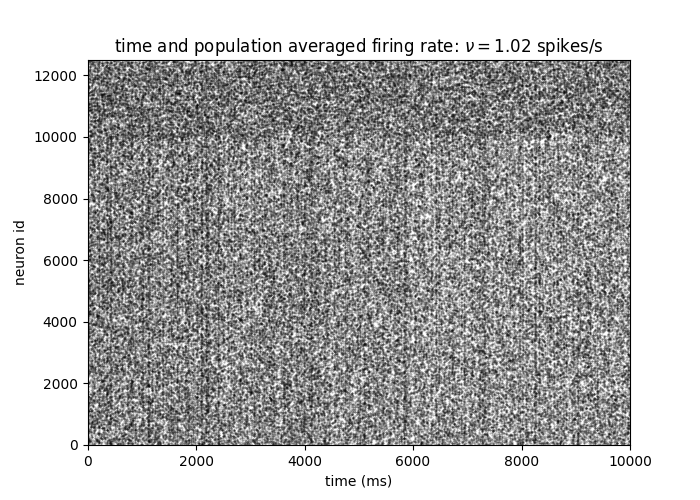
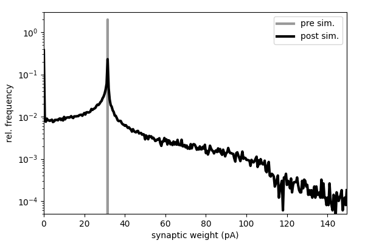

# TwoPopulationNetworkPlastic

## Overview

The ```TwoPopulationNetworkPlastic``` model describes the dynamics of a local cortical circuit at the spatial scale of ~1mm within a single cortical layer. It is derived from the model proposed in (Brunel, 2000), but accounts for the synaptic weight dynamics for connections between excitatory neurons. The weight dynamics are described by the spike-timing-dependent plasticity (STDP) model derived by Morrison et al. (2007). The model provides a mechanism underlying the formation of broad distributions of synaptic weights in combination with asynchronous irregular spiking activity (see figure below).

| **Spiking activity** | **Synaptic weight distributions** |
|--|--|
|  |  |

*Spiking activity (left) and distributions of excitatory synaptic weights (right) before ("pre sim.") and after 10s simulation ("post sim.").*

| **Connectivity matrix (pre sim)** | **Connectivity matrix (post sim)** |
|--|--|
|  |  |

*Connectivity matrices for a subset of 100 excitatory neurons before (left) and after 10s simulation (right).*

## [Model description](doc/ModelDescription_TwoPopulationNetworkPlastic.pdf)

## Available implementations
* PyNEST ([README](PyNEST/README_TwoPopulationNetworkPlastic_PyNEST.md), [code](PyNEST/model.py))

## References

[Brunel (2000). Dynamics of networks of randomly connected excitatory and inhibitory spiking neurons. Journal of Physiology-Paris 94(5-6):445-463. doi:10.1023/A:1008925309027](https://doi.org/10.1023/A:1008925309027)

[Morrison A, Aertsen A, Diesmann M (2007). Spike-timing-dependent plasticity in balanced random networks. Neural Computation 19(6):1437-1467](https://doi.org/10.1162/neco.2007.19.6.1437)

